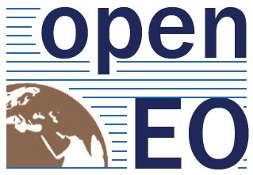

# OpenEO - Core API Concepts and Reference

The OpenEO core API defines a RESTful API that lets cloud back-ends with large Earth observation datasets communicate with front end analysis applications in an interoperable way. This documentation describes important API concepts and design decisions and gives a complete API reference documentation. As an overview, the OpenEO API specifies how to

- discover which Earth observation data and processes are available at cloud back-ends,
- execute (chained) processes on back-ends, 
- run user-defined functions (UDFs) on back-ends where UDFs can be exposed to the data in different ways, 
- download (intermediate) results as web services, and
- manage user content including accounting.

The API is defined as an [OpenAPI 3.0.0](https://github.com/OAI/OpenAPI-Specification/blob/master/versions/3.0.0.md) JSON file. To simplify and structure the development, the API is divided into a few [microservices](arch.md).

_[OpenEO](https://openeo.org), A Common, Open Source Interface between Earth Observation Data Infrastructures and Front-End Applications is a H2020 project funded under call EO-2-2017: EO Big Data Shift, under proposal number 776242. It will run from Oct 2017 to Sept 2020._

